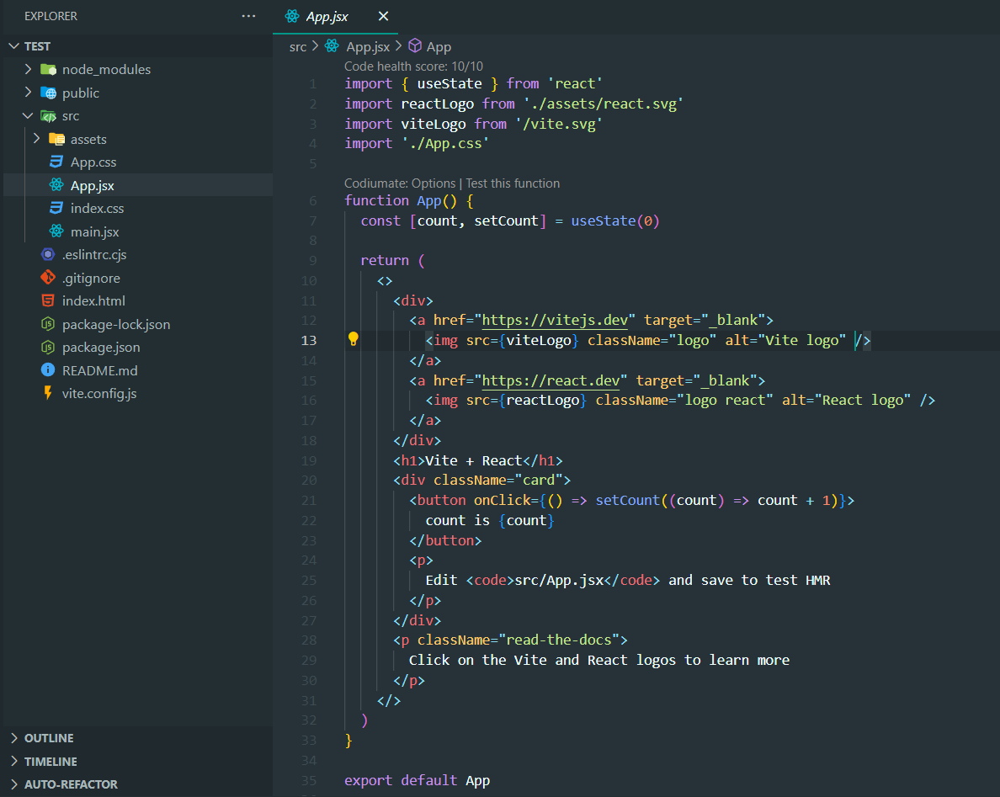
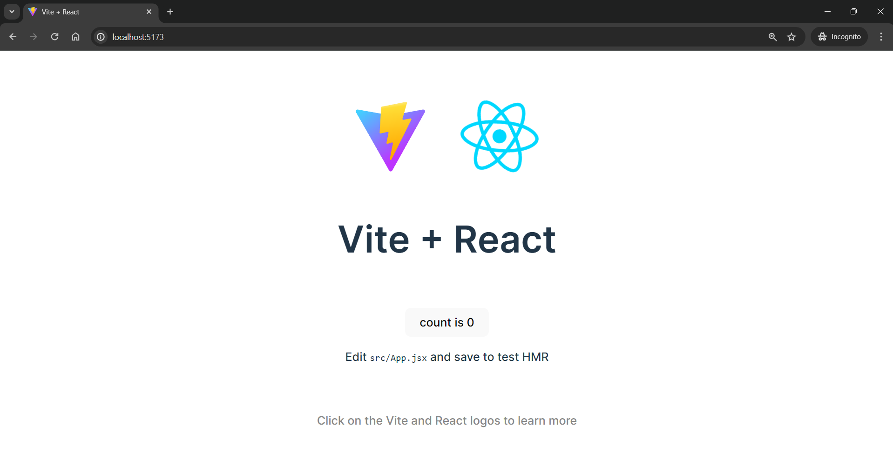
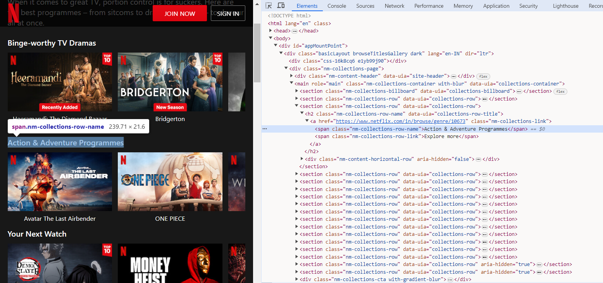
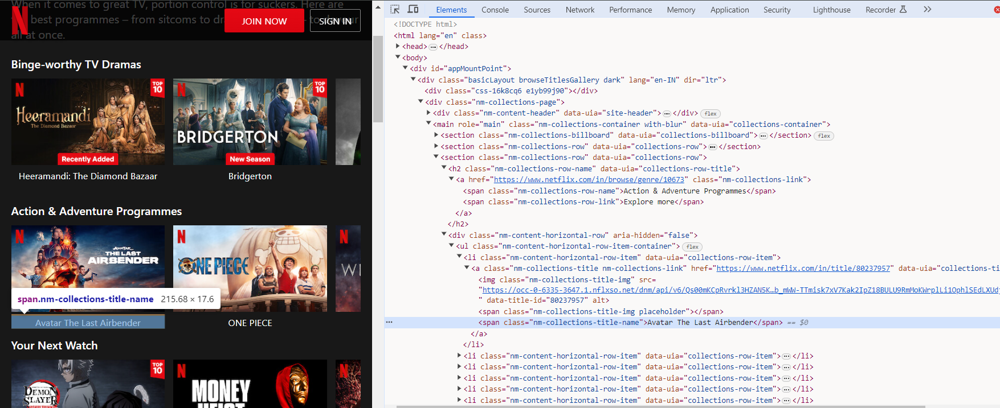
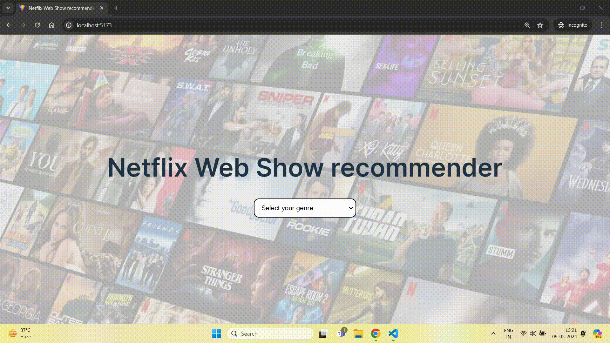

# Building a Netflix Web Show Recommender with Crawlee and React

Scraping data from Netflix is not as easy as scraping data from any regular website. Netflix's website heavily [depends on JavaScript](https://medium.com/dev-channel/a-netflix-web-performance-case-study-c0bcde26a9d9) and consists of many elements. We will create an application to suggest Netflix web shows based on selected genres. Crawlee has the capability of scraping JS-heavy websites using its headless browsers, which we will discuss further in the article.

Crawlee supports autoscaling, headless browser support, and efficient proxy management that makes scraping easy.

We will set up Crawlee and understand it's working. Let’s get started!

## Prerequisites

To use Crawlee, you need to have Node.js 16 or higher version.

You can install the latest version of Node.js from their [official website](https://nodejs.org/en/).

## Creating React app

Firstly, we will create a React app (for frontend) using Vite. Run this command in the terminal to create react app:

```
npx create-vite@latest
```

You can check out the [Vite Docs](https://vitejs.dev/guide/) to create a React app.

Once the React app is created, open it in VS Code.



This will be the structure of your React app.

Run `npm run dev` command in the terminal to run the app.



This will be the output displayed by the React app.

## Adding Scraper code

As per our project requirements, we will scrape the genres and the titles of the shows available on Netflix.

Let’s start building the scraper code.

### Installation

We will install two libraries - `crawlee` and `playwright`. Run this command to install these libraries:

```
npm install crawlee playwright
```

Note: `playwright` is not bundled with Crawlee to reduce install size and allow greater flexibility. Therefore we need to install both libraries separately.

Crawlee utilizes Playwright for [headless browser scraping](https://crawlee.dev/blog/scrapy-vs-crawlee#headless-browsing-and-js-rendering) of JavaScript rendered websites. While slower and more resource-intensive, it can scrape websites that pure HTTP crawlers can't handle, such as SPAs (single page applications).

After installing the libraries, it’s time to create the scraper code.

Create a file in `src` directory and name it `scraper.js`. Whole scraper code will be created in this file.

### Scraping genres

To scrape the genres, we will utilize the [browser Devtools](https://developer.mozilla.org/en-US/docs/Learn/Common`questions/Tools`and`setup/What`are`browser`developer`tools) to identify the tags and CSS selectors targeting the genre elements on the Netflix website.



Here, we can observe that the name of the genre is captured by the `span` tag having `nm-collections-row-name` class. So we can use the `span.nm-collections-row-name` selector to capture this and similar elements.

```js
// Use parseWithCheerio for efficient HTML parsing
    const $ = await parseWithCheerio();

// Extract genre titles
    const titles = $(".nm-collections-row-name").map((_, el) => $(el).text().trim()).get();
```

This will give us the list of all the genres stored in the `titles` array.

### Scraping shows

To scrape the titles of shows, we will use the same method we used for scraping genres. Let’s find out the tag capturing the shows’ names.



Here, we can observe that the title of the show is captured by the `span` tag having `nm-collections-title-name` class. So we can use the `span.nm-collections-title-name` selector to capture this and similar elements.

```js
// Extract show titles
    const shows = $(".nm-collections-title-name").map((_, el) => $(el).text().trim()).get();
```

This will scrape the title of all the shows and store it in the `shows` array.

```js
// Prepare data for pushing
    const allShows = [];
    let chunk = [];
    shows.forEach((show) => {
      chunk.push(show);
      if (chunk.length === 40) {
        allShows.push(chunk);
        chunk = [];
      }
    });
    if (chunk.length > 0) {
      allShows.push(chunk);
    }
```

This code takes a large list of shows in `shows` and breaks them into groups of 40 in `chunk`, storing these groups in `allShows` array.

### Storing data

Now we have every data that we want for our project and it’s time to store or save the scraped data. To store the data, crawlee comes with a `pushData()` method.

The [pushData()](https://crawlee.dev/docs/introduction/saving-data) method creates a storage folder in the project directory and stores the scraped data in the json format.

```js
await pushData({
  genre: titles,
  shows: totalShows,
});
```  

This will save the `titles` and `totalShows` arrays as values in the `genre` and `shows` keys.

Here’s the full code that we will use in our project:

```js
import { PlaywrightCrawler, log } from "crawlee";

const crawler = new PlaywrightCrawler({
  requestHandler: async ({ request, parseWithCheerio, pushData }) => {
    log.info(`Processing: ${request.url}`);
    console.log(request.label);

    // Use parseWithCheerio for efficient HTML parsing
    const $ = await parseWithCheerio();

    // Extract genre titles
    const titles = $(".nm-collections-row-name")
      .map((_, el) => $(el).text().trim())
      .get();

    // Extract show titles
    const shows = $(".nm-collections-title-name")
      .map((_, el) => $(el).text().trim())
      .get();

    // Prepare data for pushing
    const allShows = [];
    let chunk = [];
    shows.forEach((show) => {
      chunk.push(show);
      if (chunk.length === 40) {
        allShows.push(chunk);
        chunk = [];
      }
    });
    if (chunk.length > 0) {
      allShows.push(chunk);
    }

    await pushData({
      genre: titles,
      shows: allShows,
    });
  },

  // Limit crawls for efficiency
  maxRequestsPerCrawl: 20,
});

await crawler.run(["https://www.netflix.com/in/browse/genre/1191605"]);
```

Now we will run the crawlee to scrape the website. Before running the crawlee, we need to tweak the `package.json` file. We will add the `start` script targeting the `scraper.js` file to run the crawlee.

Add the following code in `"scripts"` object:

```
"start": "node src/scraper.js"
```

and save it. Now run this command to run the crawlee the scrape the data:

```
npm start
```

After running this command, you will see a `storage` folder having `datasets\default\000000001.json` file. In this json file, the scrapped data will be stored in json format.

Now we can use this json data and display it in the `App.jsx` component to create the project.

In the `App.jsx` component, we will import `jsonData` from the `000000001.json` file:

```js
import jsonData from "../storage/datasets/default/000000001.json";
```

Then we have used this `jsonData` and performed some `map` methods to get the desired results. Here is the full code of `App.jsx`:

```js
import { useState } from "react";
import "./App.css";
import jsonData from "../storage/datasets/default/000000001.json";

function App() {
  const [count, setCount] = useState();
  const handleChange = (event) => {
    setCount(event.target.value);
  };

  return (
    <div className="app-container">
      <h1 className="header">Netflix Web Show Recommender</h1>
      <div className="genre-selector">
        <select onChange={handleChange} className="select-genre">
          <option value="">Select your genre</option>
          {jsonData.genre.map((genre, key) => {
            return (
              <option key={key} value={key}>
                {genre}
              </option>
            );
          })}
        </select>
      </div>
      <div className="shows-container">
        {count && (
          <>
            <div className="shows-list">
              <ul>
                {jsonData.shows[count].slice(0, 20).map((show, index) => (
                  <li key={index} className="show-item">
                    {show}
                  </li>
                ))}
              </ul>
            </div>
            <div className="shows-list">
              <ul>
                {jsonData.shows[count].slice(20).map((show, index) => (
                  <li key={index} className="show-item">
                    {show}
                  </li>
                ))}
              </ul>
            </div>
          </>
        )}
      </div>
    </div>
  );
}

export default App;
```

In this code snippet, the `genre` array is used to display the list of genres. User can select their desired genre and based upon that a list of web shows available on Netflix will be displayed using the `shows` array.

Make sure to update CSS on the `App.css` file from here: [https://github.com/ayush2390/web-show-recommender/blob/main/src/App.css](https://github.com/ayush2390/web-show-recommender/blob/main/src/App.css)

and download and save this image file in main project folder: [Download Image](https://raw.githubusercontent.com/ayush2390/web-show-recommender/main/Netflix.png)

Now our project is ready!

## Result

Now, to run your project in the localhost, run this command:

```
npm run dev
```

This command will run your project on the localhost. Here is the demo of the project:



Project link - [https://github.com/ayush2390/web-show-recommender](https://github.com/ayush2390/web-show-recommender)

In this way, you can scrape data from any website using crawlee and create some unique projects using the scraped data.

Want to know more about Crawlee? You can watch our Crawlee guide video:

<iframe
  width="560"
  height="315"
  src="https://www.youtube.com/embed/g1Ll9OlFwEQ?si=EMeYil29LV0oDOxc"
  title="YouTube video player"
  frameborder="0"
  allow="accelerometer; autoplay; clipboard-write; encrypted-media; gyroscope; picture-in-picture; web-share"
  referrerpolicy="strict-origin-when-cross-origin"
  allowfullscreen
></iframe>
